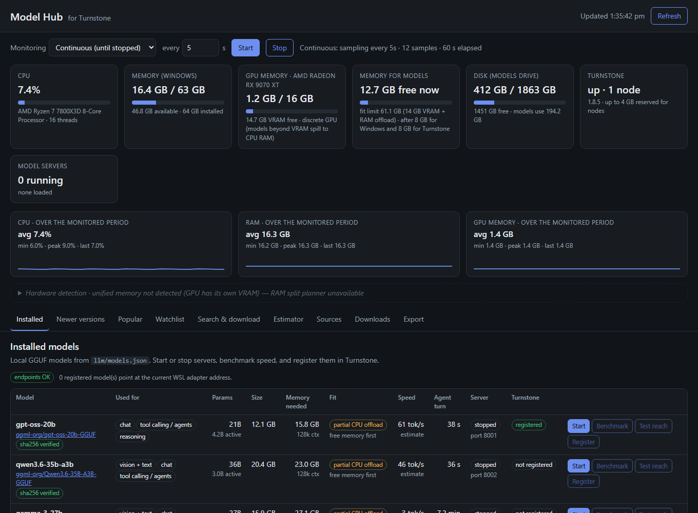

# Turnstone Model Hub

[](LICENSE)
[](#requirements)
[](#requirements)
[](https://github.com/turnstonelabs/turnstone)
[](#requirements)

Self-hosted model management for [Turnstone](https://github.com/turnstonelabs/turnstone). Find the
open models worth running, see exactly what your hardware can hold and how fast it will go, download
them safely, and hand them to Turnstone as ready-to-use endpoints — all from one local dashboard.
Your models, your hardware, your data: no accounts, no telemetry, no phone-home.

<p align="center">
  
  <br/>
  <sub><em>For reference only: example data for a typical desktop (Ryzen 7 7800X3D, Radeon RX 9070 XT 16 GB, 64 GB RAM). What you see depends on your hardware and models.</em></sub>
</p>

Turnstone flips stones to see what's underneath. Model Hub does the same for the model landscape:
what's new, what's popular, what actually fits — before you spend 80 GB of bandwidth finding out.

> [!IMPORTANT]
> **Standalone, unofficial companion.** Model Hub is an independent project. It is **not** part of,
> affiliated with, or endorsed by [Turnstone Labs](https://github.com/turnstonelabs). Turnstone itself
> is created and maintained by Edk00. Model Hub talks to Turnstone only through Turnstone's public console API.
>
> You're welcome to try it and share feedback: [open an issue](../../issues) with what worked, what
> didn't and your hardware.

## What it does

Turnstone orchestrates tool-using agents across the models you give it. Model Hub manages those
models on the machine that runs them.

- **Knows your hardware** — detects the GPU (vendor-neutral, via DXGI), unified vs. dedicated memory,
  live GPU memory use, RAM bandwidth and the memory actually available for models. Every value shows
  whether it was detected, derived or assumed — nothing has to be typed in.
- **Plans unified memory** — on APUs like AMD Ryzen AI Max (Strix Halo) it shows
  how the BIOS splits RAM between CPU and GPU and lets you test other splits before rebooting into
  the BIOS. Greyed out automatically on PCs whose GPU has its own VRAM.
- **Answers "will it fit, and how fast?"** — per file variant: memory needed (weights + KV cache for
  your context), fit category, generation and prompt speed, seconds per Turnstone agent turn.
  Benchmarks calibrate the estimates to your machine.
- **Finds what's next** — newer releases from the families you run, a watchlist of notable open
  models (DeepSeek, Kimi, GLM, MiniMax, Qwen, Gemma, Nemotron, gpt-oss and more), and what's trending
  on Hugging Face and GitHub.
- **Downloads safely** — Hugging Face, ModelScope and GitHub releases; weights-only formats, HTTPS and
  host allow-lists, mandatory SHA-256 verification, and a checker for any new source.
- **Hands models to Turnstone** — starts llama.cpp servers where Turnstone's containers can reach
  them, tests that path from inside a Turnstone node, registers the endpoint in the console, and
  repairs it if Windows changes the WSL address.
- **Watches resources on your terms** — continuous, fixed-duration or averaged CPU/RAM/GPU monitoring,
  or fully stopped with zero background work.
- **Exports** — HTML report, CSV model table, JSON snapshot.

## How it fits with Turnstone

```
 Windows host                                              WSL 2 (Docker)
 ┌───────────────────────────────────────────┐            ┌─────────────────────────────┐
 │ Model Hub  http://127.0.0.1:8099          │  admin API │ Turnstone console :8090     │
 │   discover · estimate · download · verify ├───────────▶│   Models tab                │
 │   start/stop · benchmark · register       │            │ Turnstone nodes             │
 │                                           │            │   │ openai-compatible calls  │
 │ llama-server (Vulkan / ROCm / CUDA)  ◀────┼────────────┼───┘ http://<WSL addr>:800x │
 │   llm/models/*.gguf                       │            └─────────────────────────────┘
 └───────────────────────────────────────────┘
```

Turnstone never reads model files. It calls each model's llama.cpp server over HTTP; Model Hub makes
sure those servers exist, are reachable from Turnstone's containers, and are registered correctly.

## Quickstart

Windows PowerShell, with Turnstone installed via its [one-line installer](https://github.com/turnstonelabs/turnstone#docker) in WSL:

```powershell
cd model-hub
.\run-hub.ps1                 # opens http://127.0.0.1:8099 (Ctrl+C to stop)
.\run-hub.ps1 -Background     # or run hidden; stop with .\stop-hub.ps1
```

Connect it to Turnstone (optional — needed to register models). Create a token for your admin user,
then save it to `config/turnstone.token`:

```powershell
wsl -d Ubuntu-24.04 --cd ~/turnstone -- docker compose exec node-1 turnstone-admin create-token --user <admin-user-id> --name model-hub --scopes read,write,approve
```

Then: **Search & download** a model → tick *"start it, test that Turnstone can reach it and register
it"* → it appears in Turnstone's Models tab when the download finishes.

## Hardware support

| GPU type | Detected as | Memory model used for "fit" | RAM split planner |
|---|---|---|---|
| Unified memory (AMD Ryzen AI / Strix Halo, other APUs, Intel iGPUs) | `integrated` | BIOS-reserved GPU memory + RAM Windows lets the GPU borrow | **Active** |
| Dedicated VRAM (NVIDIA, AMD Radeon RX/PRO) | `discrete` | VRAM; overflow modelled as partial CPU offload | Greyed out |
| No GPU | `none` | System RAM, CPU inference | Greyed out |

> [!NOTE]
> **On unified-memory PCs, RAM figures are indicative.** CPU and GPU share one pool, and Windows'
> counters for it overlap and miss some driver allocations. RAM used/available, GPU memory, the RAM
> split and "fit" may not be correct; check Task Manager and benchmark before relying on them. The
> dashboard shows this note in the Hardware detection panel. See
> [docs/ASSUMPTIONS.md](docs/ASSUMPTIONS.md#disclaimer-ram-figures-on-unified-memory-pcs-are-indicative).

**Test system:** developed and tested on one unified-memory mini PC (AMD Ryzen AI Max+ 395, 128 GB)
with llama.cpp Vulkan. Discrete-GPU and CPU-only configurations are covered by unit tests only, so
[reports from real hardware](../../issues) are especially welcome.

## Architecture

Python standard library only — no `pip install`. Plain HTML/CSS/JS front end — no build step.

| Component | Purpose |
|---|---|
| `hub/server.py` | HTTP server, JSON API, localhost-only security checks |
| `hub/hardware.py`, `hub/dxgi.py`, `hub/pdh.py` | GPU/RAM detection, unified-memory budget and split planner, live GPU counters |
| `hub/estimates.py`, `hub/gguf.py` | Memory/speed/agent-turn model; GGUF header reader (local files and HTTP range reads) |
| `hub/discovery.py`, `hub/hf.py`, `hub/github.py`, `hub/modelscope.py` | Successors, watchlist, popular, search, repo details |
| `hub/sources.py`, `hub/downloads.py` | Source safety checks; resumable, host-checked, SHA-256-verified downloads |
| `hub/local_models.py`, `hub/turnstone_api.py` | llama-server control, benchmarks, reach tests, Turnstone registration and endpoint repair |
| `hub/monitor.py` | Continuous / fixed-duration / averaged resource sampling |
| `web/` | Dashboard |
| `config/` | `hub.json`, `sources.json`, `watchlist.json`, `pricing.json` |
| `../llm/models.json` | Local model registry, shared with `llm-start.ps1` / `llm-stop.ps1` |

## Documentation

| Topic | Link |
|---|---|
| How the dashboard works | [docs/ARCHITECTURE.md](docs/ARCHITECTURE.md) |
| Notes and assumptions behind every number | [docs/ASSUMPTIONS.md](docs/ASSUMPTIONS.md) |
| RAM segregation on unified-memory PCs | [docs/ASSUMPTIONS.md#ram-segregation-on-unified-memory-pcs](docs/ASSUMPTIONS.md#ram-segregation-on-unified-memory-pcs) |
| Connecting to and integrating with Turnstone | [docs/INTEGRATION.md](docs/INTEGRATION.md) |
| HTTP API reference | [docs/API.md](docs/API.md) |
| Security model and download safety rules | [docs/SECURITY.md](docs/SECURITY.md) |
| Introduction / announcement draft | [docs/INTRODUCTION.md](docs/INTRODUCTION.md) |

## Requirements

- Windows 10/11 with Python 3.11+
- [llama.cpp](https://github.com/ggml-org/llama.cpp/releases) `llama-server` (any backend: Vulkan, ROCm/HIP, CUDA, CPU)
- [Turnstone](https://github.com/turnstonelabs/turnstone) 1.8+ (Docker stack in WSL 2) to register models — optional for discovery, estimates and downloads
- Internet access to huggingface.co / github.com / modelscope.cn for discovery and downloads

## Security

Binds to `127.0.0.1` only, rejects foreign `Host` headers and cross-site requests, and downloads only
weights-only files (`.gguf`, `.safetensors`) from allow-listed HTTPS hosts with a verified SHA-256.
Pickle formats and executables are refused. See [docs/SECURITY.md](docs/SECURITY.md).

## Status

Version 0.1.0 — early, single-maintainer, Windows-first. Linux support for the hub itself is partial
(`/proc` fallbacks exist; GPU detection is Windows-only today).

## Feedback

Try it and tell us how it went. [Open an issue](../../issues) for bugs, wrong estimates, hardware
that was detected incorrectly, or ideas; pull requests are welcome too. Please include your GPU, RAM,
llama.cpp backend and Turnstone version. Questions about Turnstone itself belong in the
[Turnstone repository](https://github.com/turnstonelabs/turnstone), not here.

## Tests

```powershell
python -m unittest discover -s tests -v
```

Offline (no network, no GPU): GGUF parsing, memory/speed estimates, unified/discrete/CPU fit rules,
variant recommendation, hardware classification across GPU types, file-type and host safety rules.

## Credits

- **[Turnstone](https://github.com/turnstonelabs/turnstone)** by **[Turnstone Labs](https://github.com/turnstonelabs)**:
  the multi-node agent orchestration platform this companion is built around. The original system,
  its console API and its Docker/WSL installer are their work. Model Hub only uses the public API.
- **[llama.cpp](https://github.com/ggml-org/llama.cpp)** (ggml-org): the model server Model Hub starts
  and benchmarks.
- **Model publishers and quantizers** on Hugging Face, ModelScope and GitHub whose files Model Hub
  lists and downloads.

## Disclaimer

Model Hub is a standalone, community project provided "as is" under the Apache-2.0 licence, without
warranty. It is not affiliated with, endorsed by or supported by Turnstone Labs; "Turnstone" refers to
their project and is used only to describe compatibility. Hardware figures and estimates are
indicative (see [docs/ASSUMPTIONS.md](docs/ASSUMPTIONS.md)); the dashboard image above is for
reference only.

## License

[Apache License 2.0](LICENSE), the same licence as Turnstone. Model files you download carry their
own licences, shown in the dashboard; check them before use.
